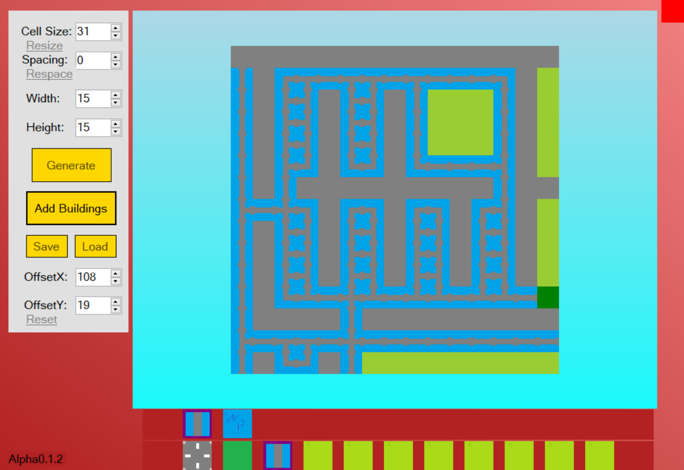

<h1>Mapster</h1>
<h2>Build and design your own city.</h2>
<b>Features</b>
<ul>
<li>Place different roads in your own way</li>
<li>Add zones to your roads (residential, commercial, industrial)</li>
<li>Manage the sewer system by placing pipes with the help of a smart system</li>
<li>Save and load different maps with the option of zooming and navigating through the map</li>
</ul>

<h2>Download and follow the readme.txt instructions.</h2>
<h3>https://mega.nz/#F!Z9BFkYTY!55c4m1m9_y76PDsDCKpAEw</h3>

<h2>Screenshots</h2>

